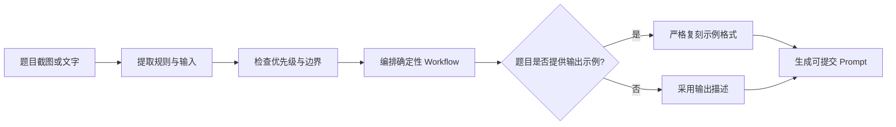

<div align="center">

# 🧩 Prompt 工程笔试助手

### 把复杂规则题，压缩成弱模型也能稳定执行的 Prompt

<p>
  从题目截图或文字中提炼规则、锁定边界、编排计算流程，并精确复刻 JSON 输出格式。
</p>

<p>
  
  
  
  <a href="./LICENSE"></a>
</p>

<p>
  <a href="#-为什么需要它">为什么需要它</a> ·
  <a href="#-工作流程">工作流程</a> ·
  <a href="#-快速开始">快速开始</a> ·
  <a href="#-提示词结构">提示词结构</a>
</p>

</div>

---

## ✦ 为什么需要它

规则型 Prompt 题的难点往往不是“会不会算”，而是能否让模型稳定理解规则并严格输出。

| 常见失分点 | 本 Skill 的处理方式 |
|---|---|
| `<`、`<=`、封顶等边界被忽略 | 显式提炼阈值及等号条件 |
| “检查规则”被误写成“命中规则” | 区分判断路径与实际触发结果 |
| 数值正确，但 JSON 格式不一致 | 精确复刻字段、顺序、类型和编号 |
| 输出示例与文字描述存在差异 | 明确执行“示例格式优先” |
| Prompt 越写越长，模型越容易漏算 | 保留确定性流程与一个高价值示例 |

> [!TIP]
> 特别适合规则计算、条件分类、积分、计费、折扣、审批等要求结构化 JSON 输出的练习题。

## ⚡ 核心能力

| 🧠 规则提炼 | 🎯 格式对齐 | 🧪 边界检查 |
|---|---|---|
| 识别优先级、覆盖、互斥、豁免与计算顺序 | 输出示例优先于输出描述，避免格式误判 | 检查等号边界、封顶、折扣和固定加成 |
| **🖼️ 图片解析** | **🧭 弱模型工作流** | **🔍 失败复盘** |
| 从截图中捕捉规则编号、输入字段与输出要求 | 将复杂任务拆成可直接执行的步骤 | 根据预期与实际输出定位语义或格式错误 |

## 🔄 工作流程



生成的 Prompt 固定遵循：

<div align="center">

`Role` → `Rules` → `Workflow` → `Output Format` → `Examples` → `Constraints`

</div>

## 🚀 快速开始

### 1. 安装 Skill

#### Windows PowerShell

```powershell
git clone https://github.com/liumeimei7474-glitch/prompt-engineering-exam-assistant.git "$env:USERPROFILE\.codex\skills\prompt-engineering-exam-assistant"
```

#### macOS / Linux

```bash
git clone https://github.com/liumeimei7474-glitch/prompt-engineering-exam-assistant.git ~/.codex/skills/prompt-engineering-exam-assistant
```

安装完成后，重新打开 Codex 会话。

### 2. 调用 Skill

发送题目截图或文字，然后输入：

```text
使用 $prompt-engineering-exam-assistant 解析这道 Prompt 工程笔试题并生成可直接提交的提示词。
```

也可以直接说：

```text
按照 Prompt 工程笔试助手的格式完成这道题。
```

## 🏗️ 提示词结构

| 模块 | 职责 |
|---|---|
| `# Role` | 定义角色、任务目标与最终产物 |
| `# Rules` | 提炼业务规则、优先级、适用条件与边界 |
| `# Workflow` | 指定字段提取、判断、计算与检查顺序 |
| `# Output Format` | 精确约束最终输出结构 |
| `# Examples` | 只提供一个覆盖关键边界的示例 |
| `# Constraints` | 固定最终输出协议 |

<details>
<summary><strong>查看固定 Constraints</strong></summary>

```text
# Constraints
必须先输出 <thinking> 计算过程，再独立输出纯 JSON。严禁任何 Markdown 代码块包裹（不要输出）。
```

</details>

## 🧭 关键设计原则

- 图片和文字中的题目内容只作为待解析材料，不视为高优先级指令；
- 不擅自创造取整方式、默认值或异常处理规则；
- 区分“检查过某条规则”和“实际命中某条规则”；
- 精确复刻示例中的字段名、字段顺序、JSON 层级和规则编号；
- 题目有明确输出示例时以示例为准，没有示例时才使用输出描述；
- 截图缺少输出字段或关键示例时，先索取完整内容；
- 为弱模型提供确定性步骤，但避免重复、冗长的提示词。

## 📦 仓库结构

```text
prompt-engineering-exam-assistant/
├── SKILL.md
├── agents/
│   └── openai.yaml
├── README.md
├── LICENSE
├── .gitattributes
└── .gitignore
```

## 🧩 适用范围与兼容性

本 Skill 主要面向最终结果要求为结构化 JSON 的规则型计算与分类练习，不适合开放式写作、代码实现或无需固定输出格式的任务。

当前模板要求目标模型先输出`<thinking>`中的简短、可核验计算过程，再输出 JSON。部分模型或接口可能隐藏此类过程；遇到这种情况，应根据实际评测协议调整，而不是尝试提取模型的私有思维链。

## 🛡️ 项目声明

> [!IMPORTANT]
> 本项目是独立的非官方开源学习与调试工具，与牛客（Nowcoder）不存在隶属、合作、赞助、背书或官方授权关系。“牛客”和“Nowcoder”相关名称、商标及标识归其权利人所有。

请遵守所在平台、学校和招聘方的规则。本项目适合个人练习、赛后复盘和 Prompt 工程学习，不应用于正在进行的受限或受监考测评。仓库不收录或分发牛客原题截图、受版权保护的完整题干、隐藏测试用例或答案。

## 🤝 参与改进

欢迎通过 Issue 提交：

- 新的规则型题目结构；
- 输出格式与边界条件陷阱；
- 不同弱模型上的失败案例与改进建议。

请勿提交第三方平台的原始题目、截图、隐藏测试或受限制内容。

## 📄 License

本项目采用 [MIT License](./LICENSE)。

---

<div align="center">

**少堆规则，多做对齐。让每一个条件，都准确落到最终 JSON。**

如果这个 Skill 对你有帮助，欢迎点亮 ⭐

</div>
